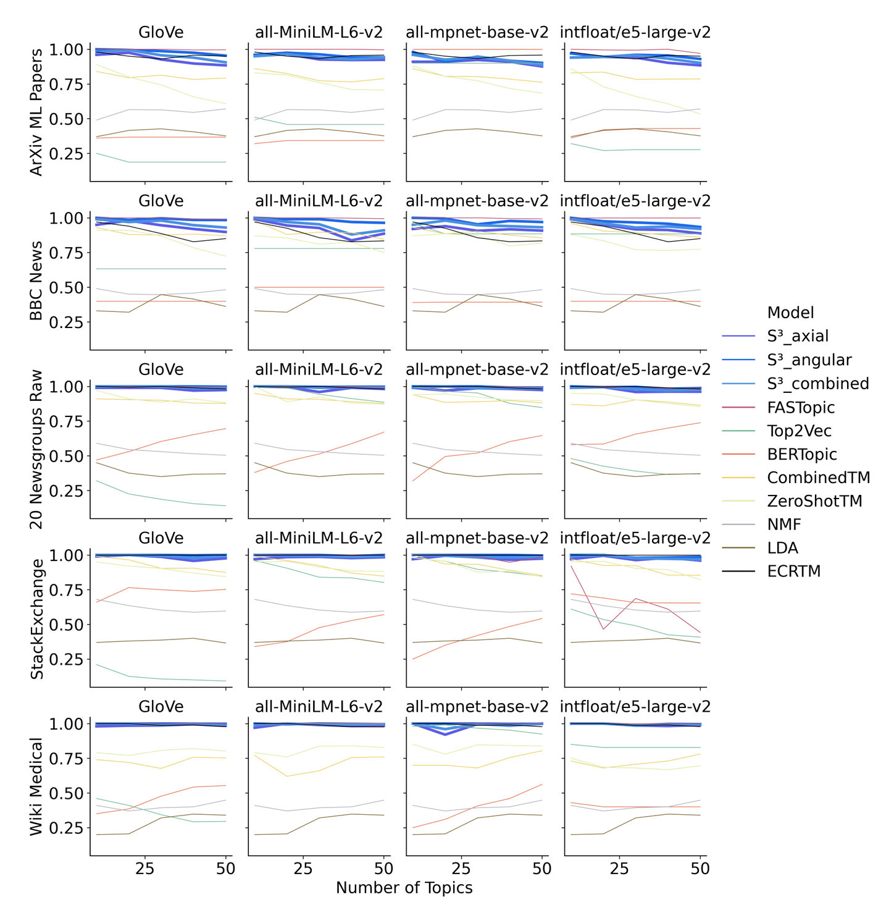
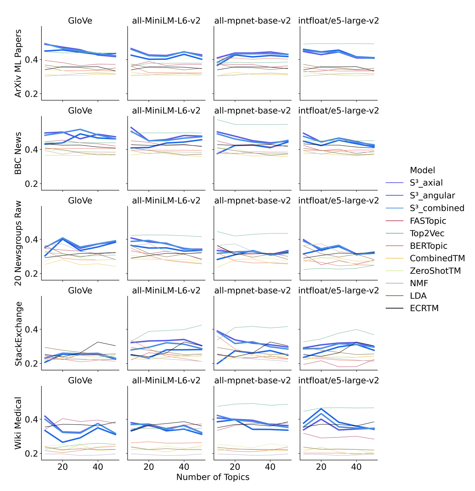
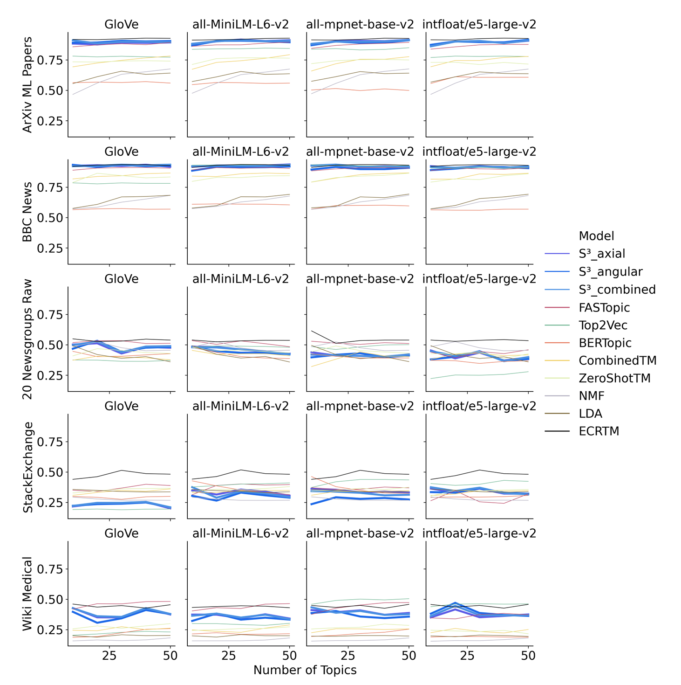
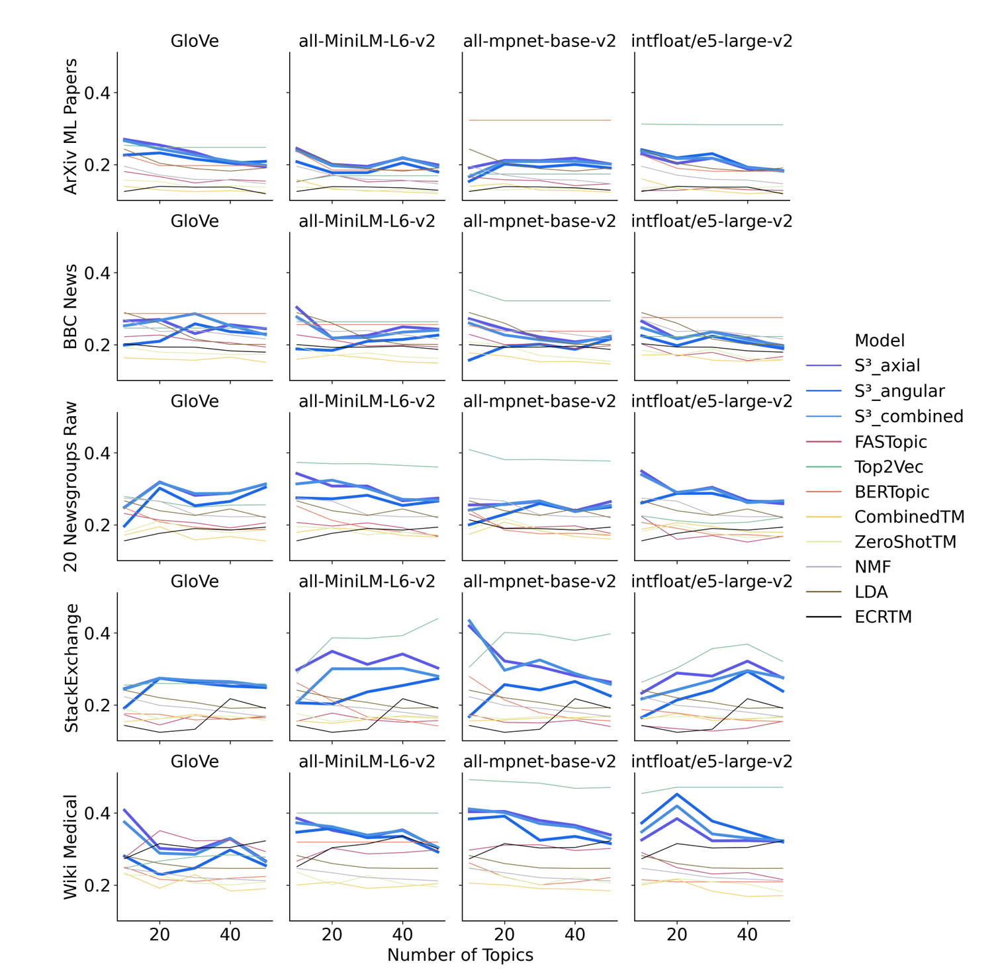
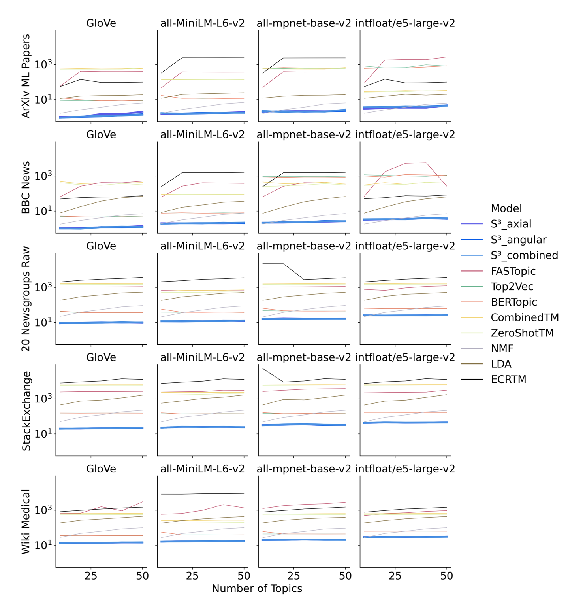

1. Bộ dữ liệu sử dụng
- 20 Newsgroups (cả bản gốc và bản đã tiền xử lý)
- BBC News
- ArXiv Machine Learning abstracts (2048 mẫu)
- Wikipedia – Medical terms
- StackExchange entries
 => Các tập dữ liệu này đa dạng về lĩnh vực, giúp kiểm chứng tính tổng quát của mô hình.

2. Embedding Models
- Averaged GloVe (static)
- SBERT: all-MiniLM-L6-v2, all-mpnet-base-v2
- E5-large-v2: open source -> text embedding models -> convert từ câu, đoạn văn, tài liệu thành 1024  -> để tìm kiếm ngữ nghĩa và truy vấn tasks

=> Việc dùng nhiều embedding giúp kiểm tra độ ổn định của S3.

3. Các Tocpic model được thực nghiệm cùng:
- BERTopic, Top2Vec, ZeroShotTM, CombinedTM, FASTopic, ECRTM
- 2 loại cổ điển: LDA và NMF
- Tất cả models đều được chạy với 10, 20, 30, 40, và 50 topic. Mỗi model đều cho ra 10 terms (từ khoá) cho mỗi topic.

4. Metrics
- Topic Diversity (đa dạng): đo sự khác biệt giữa các chủ đề.

Diversity scores across all models, datasets, encoders, and numbers of topics
- Topic conherence ( mạch lạc):  đo mức độ gắn kết của từ trong chủ đề (dùng cả internal & external coherence).

 Aggregate coherence scores across all models, datasets, encoders, and numbers of topics, computed as
geometric mean of internal and external word embedding coherence
- Robustness ( độ ổn định):  kiểm tra tỷ lệ từ vô nghĩa, stop words.

WECin scores across all models, datasets, encoders, and numbers of topics

 WECex scores across all models, datasets, encoders, and numbers of topics
- Runtime (thời gian chạy)

Runtime in seconds for all models, datasets, encoders, and numbers of topics

5. Kết luận
- Tác giả giới thiệu S3 (Semantic Similarity-based Topic Modeling) như một phương pháp mới để trích xuất chủ đề từ văn bản.
- S3 vượt trội về hiệu năng tổng hợp: trung bình nhanh hơn 27.5 lần so với các baseline, đồng thời đạt điểm cao nhất về thước đo tổng hợp (coherence × diversity).
- Cân bằng giữa mạch lạc và đa dạng:

 - Top2Vec → chủ đề rất mạch lạc nhưng kém đa dạng.
 - ECRTM, FASTopic → chủ đề đa dạng nhưng kém mạch lạc.
 - S3 → đạt sự cân bằng tối ưu giữa hai yếu tố.
- Độ ổn định: S3 ít bị nhiễu bởi stop words và ký tự vô nghĩa hơn hẳn LDA, NMF, BERTopic.
- Ảnh hưởng của tiền xử lý:
 - Các baseline thường cần tiền xử lý để cải thiện kết quả.
 - S3 lại tốt hơn khi không tiền xử lý, tận dụng được thông tin ngữ cảnh bổ sung.
- Ảnh hưởng của mô hình nhúng:
 - S3 hoạt động ổn định trên nhiều loại embedding (SBERT, E5, GloVe).
 - Một số mô hình khác (như Top2Vec) bị giảm chất lượng khi dùng embedding lớn (E5).

Đánh giá định tính:
 - LDA, NMF, BERTopic → nhiều từ vô nghĩa, khó diễn giải.
 - CTM, ECRTM → khá hơn nhưng vẫn nhiều chủ đề khó hiểu.
 - FASTopic → nhiều thông tin nhưng đôi khi gộp hai chủ đề khác nhau.
 - S3 và Top2Vec → cho ra các chủ đề rõ ràng, cụ thể, dễ hiểu nhất.

Kết luận: S3 là phương pháp khả thi, hiệu quả, vừa nhanh vừa cho chủ đề chất lượng cao.

